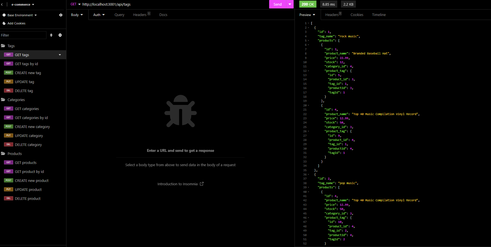

# E-commerceBackEnd

## Description

- This project was created to demonstrate the back end application to help manage a front end e-commerce application.
- This helps companies stay organized with an ever changing product line and stock.
- Having the back end capabilities this project provides will help automate the GUI on the front end helping both the employees and the shoppers.
- This project showed me that separation of concerns can help a developer stay organized as well as the balance between the relationships in the table models and the api routes.

## Table of Contents

- [Installation](#installation)
- [Usage](#usage)
- [Credits](#credits)
- [License](#license)

## Installation

This project requires the node packages express, mysql2, and sequelize as well as dotenv for privacy. Additionally, seed data is provided to test the application. You can access this through the terminal through "node seeds/index.js or by using the script "npm run seed".

## Usage

This application is completely back end, therefore, requires an environment such as insomnia to view data. Run the server using "node server.js" and use the port shown in the console log in insomnia: http://localhost:PORT

[Link to video demo](https://drive.google.com/file/d/1Jmo46EbtmVVWI_YGmUcayLBgoncXWbpu/view)
------------

## Credits
Node Packages:
- 
- mysql2
- 
- dotenv

## License

MIT License

Copyright (c) [2023] [Mitchell Wandall]

Permission is hereby granted, free of charge, to any person obtaining a copy
of this software and associated documentation files (the "Software"), to deal
in the Software without restriction, including without limitation the rights
to use, copy, modify, merge, publish, distribute, sublicense, and/or sell
copies of the Software, and to permit persons to whom the Software is
furnished to do so, subject to the following conditions:

The above copyright notice and this permission notice shall be included in all
copies or substantial portions of the Software.

THE SOFTWARE IS PROVIDED "AS IS", WITHOUT WARRANTY OF ANY KIND, EXPRESS OR
IMPLIED, INCLUDING BUT NOT LIMITED TO THE WARRANTIES OF MERCHANTABILITY,
FITNESS FOR A PARTICULAR PURPOSE AND NONINFRINGEMENT. IN NO EVENT SHALL THE
AUTHORS OR COPYRIGHT HOLDERS BE LIABLE FOR ANY CLAIM, DAMAGES OR OTHER
LIABILITY, WHETHER IN AN ACTION OF CONTRACT, TORT OR OTHERWISE, ARISING FROM,
OUT OF OR IN CONNECTION WITH THE SOFTWARE OR THE USE OR OTHER DEALINGS IN THE
SOFTWARE.

---

## How to Contribute

Feel free to use this code as you like. If there is anything you would like to add feel free to do so. 

## Tests

Seed data is provided to test the application. You can access this through the terminal through "node seeds/index.js or by using the script "npm run seed".